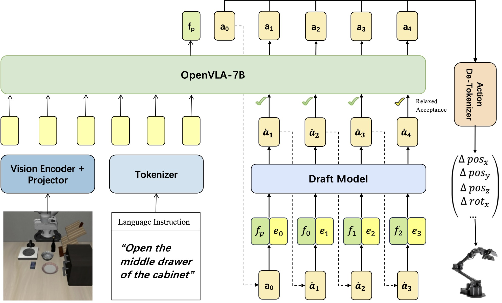
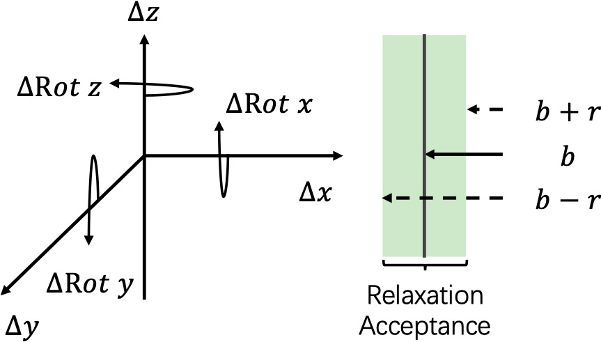

# SpecVLA

Implementation for the paper "**Spec-VLA: Speculative Decoding for Vision-Language-Action Models with Relaxed Acceptance" (EMNLP 2025).**
## Background
#### Abstract 

Vision-Language-Action (VLA) models have made substantial progress by leveraging the robust capabilities of Visual Language Models (VLMs). 
However, VLMs' significant parameter size and autoregressive (AR) decoding nature impose considerable computational demands on VLA models. While Speculative Decoding (SD) 
has shown efficacy in accelerating Large Language Models (LLMs) by incorporating efficient drafting and parallel verification, allowing multiple tokens to be generated in one forward pass, 
its application to VLA models remains unexplored. This work introduces Spec-VLA, an SD framework designed to accelerate VLA models. 
Due to the difficulty of the action prediction task and the greedy decoding mechanism of the VLA models, the direct application of the advanced SD framework to the VLA prediction task yields 
a minor speed improvement. To boost the generation speed, we propose an effective mechanism to relax acceptance utilizing the relative distances represented by the action tokens of the VLA model. 
Empirical results across diverse test scenarios affirm the effectiveness of the Spec-VLA framework, and further analysis substantiates the impact of our proposed strategies, 
which enhance the acceptance length by 44%, achieving $1.42\times$ speedup compared with the OpenVLA baseline, without compromising the success rate. 
The success of the Spec-VLA framework highlights the potential for broader application of speculative execution in VLA prediction scenarios.

#### Proposed Methods
* The Spec-VLA framework is the first SD framework for  Autoregressive VLA generation acceleration. The Spec-VLA utilizes multimodal features and incorporates multiple advanced methodologies for SD, including tree-attention and dynamic draft tree decoding.

&nbsp;&nbsp;&nbsp;

* Distance-sensitive relaxation of acceptance. We propose to relax the acceptance condition for the VLA prediction scenario while controlling the prediction precision with the predefined relaxation threshold. 

&nbsp;&nbsp;&nbsp;&nbsp;&nbsp;&nbsp;&nbsp;&nbsp;&nbsp;

#### Practical Advantages 
* Compared with the previously proposed VLA acceleration methods, such as PD-VLA, the Spec-VLA does not need full-parameter finetuning for the backbone models, which decouples the acceleration framework and the original models, and supports efficient adaptation for downstream tasks.
* The verification mechanism ensures the generation quality and provides a predefined threshold parameter to balance the speed-quality tradeoff.
* Achieves 22%-42% acceleration in the LIBERO dataset, without compromising the prediction accuracy.

## Setup Guidance
#### Requirements & Installation

* Python >= 3.10
* Pytorch == 2.2.0 (tested with cuda == 12.1)
* Libero == 0.1.0
* ``pip install -r requirements-min.txt``
* ``cd openvla``
* ``pip install -e .``

## Main Files

We derive our resposary from OpenVLA, and provide the impelementation for the SpecVLA framework. The main architecture is listed below: 

```
SpecVLA
├── openvla
│   ├── experiments                # Scripts for conducting libero simulation benchmark and speedup test
│   ├── prismatic                  # Derived from the openvla
│   ├── scripts                    # Derived from the openvla
|   └── specdecoding               # SpecVLA implementation
├── dataset                        # Finetuning dataset 
└── backbone_models                # Finetuned OpenVLA models
```

#### Experiment Pipeline

#### Training data generation
```
python SpecVLA/openvla/specdecoding/train-scripts/ge_data_all_openvla_goal.py
```
#### Training Draft models
```
export PYTHONPATH='/SpecVLA'
WANDB_MODE='offline' deepspeed --master_port 23333 --include=localhost:4,5,6,7 "SpecVLA/openvla/specdecoding/train-scripts/train_deepspeed_libero_goal.py" --deepspeed_config "/SpecVLA/openvla/specdecoding/scripts/ds_config.json"
```
#### Testing on LIBERO simulation benchmark
Autoregressive Generation
```
CUDA_VISIBLE_DEVICES=0 MUJOCO_EGL_DEVICE_ID=0 python /SpecVLA/openvla/experiments/robot/libero/run_libero_goal_AR.py\
  --model_family openvla \
  --pretrained_checkpoint /openvla-7b-finetuned-libero-goal \
  --task_suite_name libero_goal \
  --center_crop True
```
Speculative Decoding
```
CUDA_VISIBLE_DEVICES=0 MUJOCO_EGL_DEVICE_ID=0 python /SpecVLA/openvla/experiments/robot/libero/run_libero_goal_Spec.py \
    --model_family openvla \
    --pretrained_checkpoint /openvla-7b-finetuned-libero-goal \
    --task_suite_name libero_goal \
    --center_crop True
```
Speculative Decoding with Relaxed Acceptance
```
CUDA_VISIBLE_DEVICES=0 MUJOCO_EGL_DEVICE_ID=0 python /SpecVLA/openvla/experiments/robot/libero/run_libero_goal_Spec_Relaxed.py \
    --model_family openvla \
    --pretrained_checkpoint /openvla-7b-finetuned-libero-goal \
    --task_suite_name libero_goal \
    --center_crop True
```

## Citing

Please kindly cite us if you find our papers or codes useful.
```
@article{wang2025spec,
  title={Spec-VLA: Speculative Decoding for Vision-Language-Action Models with Relaxed Acceptance},
  author={Wang, Songsheng and Yu, Rucheng and Yuan, Zhihang and Yu, Chao and Gao, Feng and Wang, Yu and Wong, Derek F},
  journal={arXiv preprint arXiv:2507.22424},
  year={2025}
}
```
